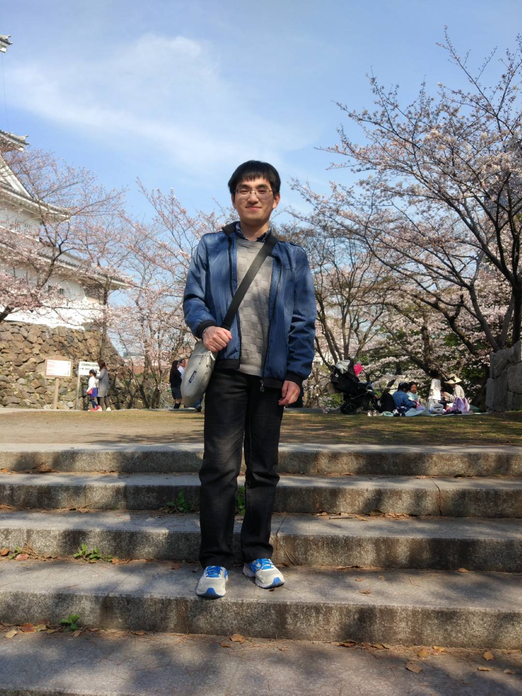

---
# Feel free to add content and custom Front Matter to this file.
# To modify the layout, see https://jekyllrb.com/docs/themes/#overriding-theme-defaults

layout: default
---

Hello, my name is 孙一平(SUN Yiping). 
I got my bachelor degree in Shanghai JiaoTong University (Computer Science, 2017). 
Now I am pursing double master degrees in Shanghai JiaoTong University (Computer Science, CyberSpace Intelligence Computing Lab) and Waseda University (Information, Furuzuki Lab). I am interested in Knowledge Extraction, Knowledge Graph and Applications of deep learning in Knowledge.

Education

+ 2013.9 - 2017.6 IEEE Honored Class, School of Electronic Information and Electrical Engineering, Shanghai JiaoTong University
+ 2016.9 - 2018.6(Expected) Furuzuki Lab, Graduate School of Information, Production and Systems, Waseda University
+ 2017.9 - 2020.3(Expected) CyberSpace Intelligence Computing Lab, School of Electronic Information and Electrical Engineering, Shanghai JiaoTong University

Publication

1. **Yiping SUN**, Yu CUI, Jinglu HU, and Weijia JIA. *\"Relation Classification using Coarse and Fine-Grained Networks with SDP Supervised Key Words Selection\"*, International Conference on Knowledge Science, Engineering and Management, KSEM\'2018(CCF C, to appear)
2. Yu CUI, **Yiping SUN** and Jinglu HU. *\"A convolutional auto-encoder method for anomaly detection on system logs\"*, IEEE SMC\'2018(to appear)

Reward

1. 国际机器人实作竞赛，篮球机器人项目(第一名)，台湾, 2014
2. 中国机器人大赛暨RoboCup公开赛，篮球机器人项目(一等奖)，合肥，2014
3. 中国机器人大赛暨RoboCup公开赛，篮球机器人项目(一等奖)，贵州，2015(领队)
4. IPS Special Scholarship for International Students, 2016-2017
5. Honors Scholarship for Privately Financed International Students, 2016-2017
6. Azusa Ono Memorial Scholarship for International Students, 2018
